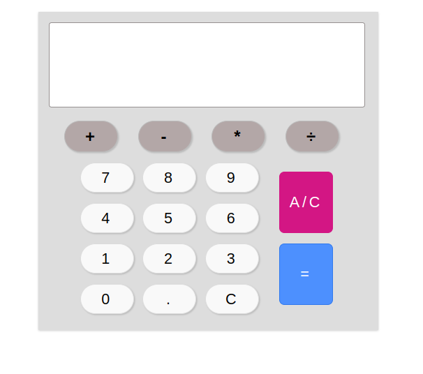

### 4: JAVASCRIPT CALCULATOR

Das Programmieren eines guten alten Taschenrechners ist eine hervorragende Übung für deine JavaScript-Kenntnisse. Erstelle eine saubere Oberfläche mit HTML und CSS und füge dann mit JavaScript verschiedene Funktionen hinzu.

Beginne mit ein paar grundlegenden Operatoren und Schaltflächen für:

- Additionen
- Subtraktionen
- Multiplikationen
- Divisionen